# Description

```
En vagabondant dans le café, vous rencontrez le mystérieux Balzac. Il vous appelle dans un coin discret et vous tend une boîte étrange. Il vous dit que c'est une "VM", ou "Vélocipède Mécanique", une machine de fabrication étrangère qui ressemble à une machine à écrire, mais qui semble bien plus avancée.

Il vous tend également une feuille qu'il appelle un "programme". Il vous explique que si vous insérez cette feuille dans la machine, elle déclenche un comportement particulier. Vous êtes fasciné par cette mystérieuse machine et vous vous demandez ce qu'elle pourrait bien faire.

Balzac vous demande de l'étudier et d'essayer de découvrir tous ses secrets. C'est un honneur qu'il vous fasse confiance pour cette mission, mais vous ne savez pas encore par où commencer.
```

# First look

We are given 2 files: `vm` and `reverse_my_vm.vmr`. Let's look at what they are :

```bash
$ file vm         
vm: ELF 64-bit LSB pie executable, x86-64, version 1 (SYSV), dynamically linked, interpreter /lib64/ld-linux-x86-64.so.2, BuildID[sha1]=dec1df6118749f385df6c2efbca6e4ce43f885dc, for GNU/Linux 3.2.0, stripped
```

```bash
$ file reverse_my_vm.vmr 
reverse_my_vm.vmr: shared library
```

I was a bit intrigued by the file `reverse_my_vm.vmr`, and was not satisfied by `file` output. This is why, I looked at the hexadecimal of the file:

```bash
$ hexdump -C reverse_my_vm.vmr
00000000  01 04 6d 61 69 6e 02 7c  17 00 00 00 50 6c 65 61  |..main.|....Plea|
00000010  73 65 20 65 6e 74 65 72  20 74 68 65 20 6b 65 79  |se enter the key|
00000020  3a 20 00 3a 41 53 24 23  42 00 01 00 00 25 3a 44  |: .:AS$#B....%:D|
00000030  53 7c b0 00 00 00 63 3d  21 11 22 52 19 33 09 51  |S|....c=!."R.3.Q|
00000040  3b 7b 3b 2b 72 6c 62 7a  2d 0e 6b 11 17 02 16 51  |;{;+rlbz-.k....Q|
00000050  30 59 33 59 17 4c 12 55  31 0a 24 5e 16 09 58 14  |0Y3Y.L.U1.$^..X.|
00000060  42 43 06 62 56 4f 20 34  43 79 47 14 4e 2a 1e 36  |BC.bVO 4CyG.N*.6|
00000070  42 79 47 3b 72 10 7a 34  42 79 03 35 25 44 46 46  |ByG;r.z4By.5%DFF|
00000080  5a 42 03 66 7a 36 7c 67  7e 23 44 5a 59 34 7e 6c  |ZB.fz6|g~#DZY4~l|
00000090  00 6f 7d 74 21 4f 23 32  42 79 47 12 30 6d 62 34  |.o}t!O#2ByG.0mb4|
000000a0  42 5a 04 35 72 6c 62 08  06 27 03 77 4c 28 49 67  |BZ.5rlb..'.wL(Ig|
000000b0  01 54 06 73 53 9e 9d cb  bd 43 14 74 0e 74 62 34  |.T.sS....C.t.tb4|
000000c0  42 3a 28 5f 15 1e 03 40  31 58 67 68 1d 19 10 14  |B:(_...@1Xgh....|
000000d0  24 15 26 56 52 05 11 0e  62 43 06 62 56 32 23 75  |$.&VR...bC.bV2#u|
000000e0  6c 59 14 66 33 2b 5e 45  45 23 41 2c 00 00 00 3a  |lY.f3+^EE#A,...:|
000000f0  42 53 3a 53 44 2b 53 45  3c 43 3a 53 42 3c 42 5e  |BS:SD+SE<C:SB<B^|
00000100  42 43 3e 42 23 46 04 00  00 00 2b 53 46 2b 45 46  |BC>B#F....+SF+EF|
00000110  26 45 46 23 46 01 00 00  00 2d 41 46 21 d2 ff ff  |&EF#F....-AF!...|
00000120  ff 23 46 00 01 00 00 2d  53 46 28 09 63 68 65 63  |.#F....-SF(.chec|
00000130  6b 5f 6b 65 79                                    |k_key|
```

All right, it looks like some kind of program as we recognize the string `main` and `check_key` (some functions maybe ?).

This idea was confirmed when I tried to run the executable `vm`:

```bash
$ ./vm                                
Usage: ./vm <file.vmr>
```

All right, from what I understand, the file `vm` is interpreting the given file in argument (`.vmr` is the extension that would stand for a customized way of coding instructions).

Finally, I tried running `vm` with the `.vmr` file:

```bash
$ ./vm reverse_my_vm.vmr
Please enter the key: password
Error: Function "check_key" not found
```

So, we are asked a key, and this key seems to be used for finding the `check_key` function.

We have a first idea of what we are working with, so let's dive into `vm` !

# Time to cut this VM open

## Main function

Below is the main function opened with Binary Ninja decompiler.

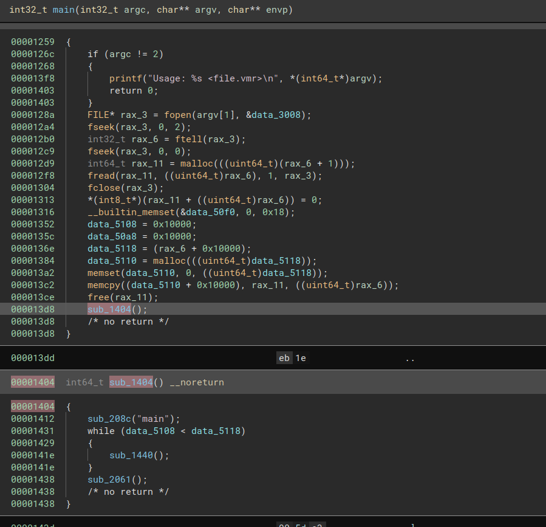

As we can see, the `.vmr` file given in argument is read, and its content is copied somewhere in the heap. It is done with the last `memcpy` on `data_5110` (pointer given by the second malloc) + `0x10000` which looks like a random offset. At first, I didn't quite understand why this offset has been defined, but I thought "let's continue, I will understand later". 

Once it's copied, the program continues in another function, which I called `main_follow_up`. In this function, there is a loop ... where the magic happens I guess ! We will take a look at it after.

After some renames, the pseudo code looks like this :

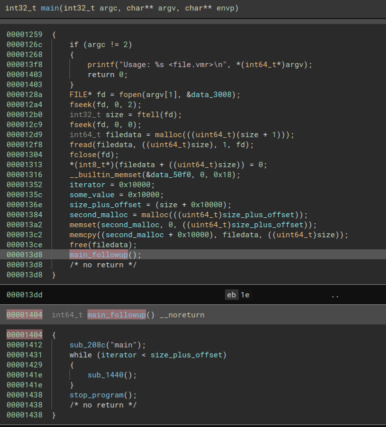
Let's dive into the `sub_208c`. My first intuition is that the function looks for a string `main` in the file passed as an argument. Remember the hexdump with the "main" string.

Here is the function:

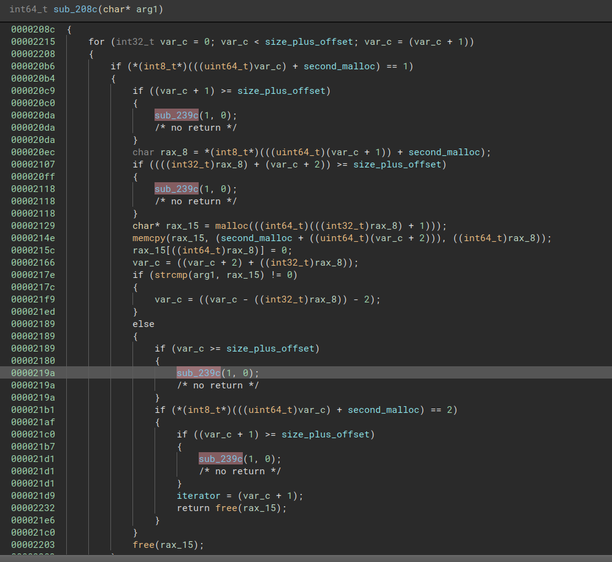

When this function is called, here is the state of memory:

```
second malloc                    ->  somewhere

[...]

second_malloc + 0x10000          -> start of file content

[...]

second_malloc + size_plus_offset -> end of file content
```

I wanted this to be clear so it's easier to understand what the first loop does. It will go through all the memory drawn above looking for a byte equal to 1. 

As the only memory set was while copying the file content, it makes me say the loop looks this byte whithin the `.vmr` file passed as an argument of `vm`.

This is why, it checks the iterator of the loop doesn't leave the file content area !

The function `sub_239c` is handling errors, and stops the program if there is one.

Then, the function looks at the byte following `0x01`. Once again, it checks iterator doesn't leave the file content area when adding 2 + the value just retrieved to it.

By seeing the next instruction, it is easy to guess the byte following `0x01` was the length of the next read bytes, as there is a `memcpy` on them.

Once those bytes are copied, it compares they are equal to the given argument, in this case: `main`. If so, the byte following the string `main` retrieved must be equal to `0x2`.

A little recap would be appreciated. The function looks for this structure in the memory where the file content has been copied (and in the memory before it): `01 LENGTH 6d 61 69 6e 02` (`6d 61 69 6e` is `main` in hexadecimal). if so, it updates `iterator` such as `second_malloc + iterator` is the address just after this header.

In the end, we can understand this function with the argument `main` looks for the `main` function in the `.vmr` file.

Once it is found, the principal loop is run ! Let's see what it does.

## The main loop

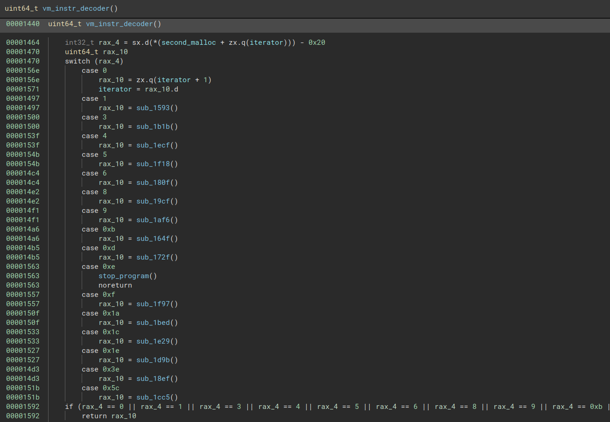

Once the `main` function is found in the `vmr` file, we enter the loop. 

The function called in it is a massive `switch` case. From this, it is likely being the function decoding the bytes read from the file, which will call functions accordingly (interpreting the given byte value).

Thanks to the line: `int32_t rax_4 = sx.d(*(second_malloc + zx.q(iterator))) - 0x20`, I understood 2 things:
- That the `iterator` variable kind of replaces the `RIP` register in ELF 64-bits program. Indeed, we go to the address `second_malloc + iterator`, which stores the byte following the `main` header at the first iteration. 
- As a result, the program reads it and according to its value, it will enter in a branch of the `switch` and executes another function.

At this point, we can understand that the bytes read are in reality bytecodes ! Those bytecodes are instructions and each value in the `switch` case at which we add `0x20` is an specific instruction.

The next step is to reverse the different instructions !

## The instructions

#### 0x2e

This one is easy ! You can see from the above screenshot, it is already reversed ! The function called is the same than the one called after the loop in `main_follow_up` ! 

Thus, `0x2E` is called **to stop the execution of the program**.

*Syntax in a `vmr` file:*
- `2E` -> meaning the instruction doesn't take any arguments !

#### 0x20

This is also an easy one. You can see, it just set the `iterator` variable, to its value + 1. In other words, it basically sets the custom `rip` to the address of the next bytecode, or the next instruction. 

It is the equivalent of the NOP operation in ASM.

*Syntax in a `vmr` file* :
- `20` -> No argument either

#### 0x7c

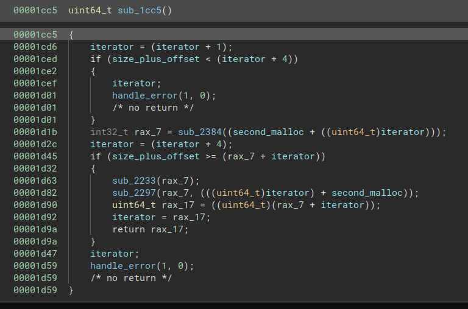

First, the program increments `iterator` value (as it has already read the bytecode value). Then, it looks if it can read the 4 next bytes, meaning it checks that it doesn't leave the custom `.vmr` file content if the `iterator` is added 4. If so, it returns an error.

Then, a function is called. If we look at the operations in it, we can conclude it is just reading an integer on 4 bytes at the address passed in argument and returns its value.

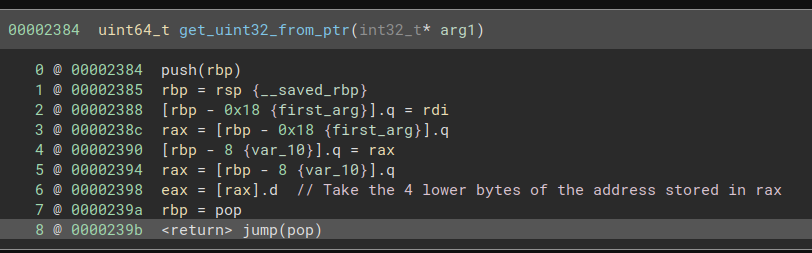

Then, as the function checked before if it could add 4 to `iterator`, it does the operation without risking leaving the custom program area.

To give more sense of what the function is doing and what is the `uint32` the above function just read, look how it is used in `reverse_my_vm.vmr`:

```bash
00000000  01 04 6d 61 69 6e 02 7c  17 00 00 00 50 6c 65 61  |..main.|....Plea|
00000010  73 65 20 65 6e 74 65 72  20 74 68 65 20 6b 65 79  |se enter the key|
00000020  3a 20 00                                          |: .
```

As you can see, following the `7c` byte, we see the 4 bytes `17 00 00 00` and then a string. We can do a quick check and YES !

```python
len("Please enter the key: ") # = 0x16
```

If you add the null byte, you obtain the length of the string.

Thus, it looks like the function retrieves the size of a string on the 4 bytes after the bytecode `0x7c` and reads the stored string of this size.

With this realization, it seems natural that the function called by the bytecode verifies it can read the string from the program with this next instruction: 
```
if (size_plus_offset >= (rax_7 + iterator))
```

If it is okay, then it calls 2 very interesting functions that will help us understand the role of the variable I named at the beginning `some_value`.

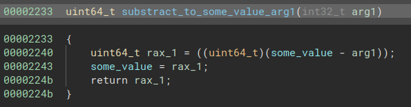

Well, the name I gave to the function is pretty straightforward.

Let's see the other function:

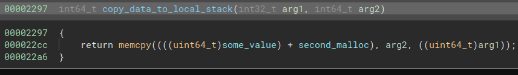

This function copies the string (passed as arg2) to the following destination:

```
((uint64_t)some_value) + second_malloc
```

Do you see it now ?

The variable `same_value` is actually a stack pointer register. If I keep doing analogies, it is `RSP` ! The only difference is it doesn't contain the address of the top of the stack directly but only the offset from `second_malloc` address to access the top of the stack.

Allow me to draw you how all of this is stored in the **REAL** memory:

```
second_malloc address                          -> somewhere

[...]

second_malloc address + top_local_stack_ptr   -> Top of the stack

[... local stack ...]

second_malloc address + 0x10000               -> Start of .vmr content and end                                                    of local stack

[...]
second_malloc address + iterator              -> somewhere in .vmr file content
[...]

second_malloc address + size_plus_offset      -> End of .vmr file content
```

With this schema, all the next instruction will be very clear for you.

If we go back to the `7c` instruction, we understand it is reading a string and copies it on the local stack, taking care of moving the `top_local_stack_ptr`   and `iterator` by doing so.

*Syntax in a `vmr` file* :

`7c SIZE_STR_ON_4_BYTES STR...` -> this bytecode differs from the first ones, it takes arguments !

Moving on !

#### 0x3a

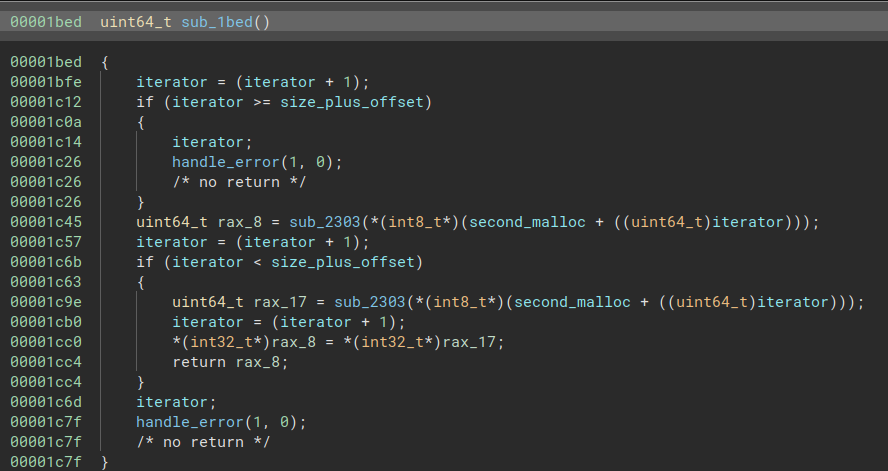

Exactly like the previous function, it checks it can read the byte after the bytecode `0x3a` in this case.

Then, according to the lines:

```
uint64_t rax_8 = sub_2303(*(int8_t*)(second_malloc + ((uint64_t)iterator)));
iterator = (iterator + 1);
```

the program is doing an operation on one byte as `iterator` is incremented of 1 after the function call.

Let's see what it does:

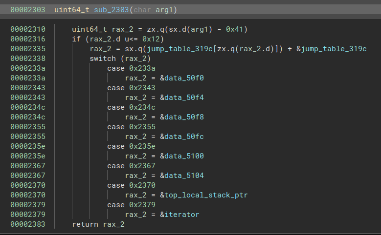

In this case, `arg 1` is the value read after the bytecode `0x3a`. It is substracted to it `0x41`. According to the `if`, the value should be between `0x41` and `0x53`.

Then, an operation is done on the address of a table and the value stored in it at the index `rax_2`.

According to the result, we enter a `switch` case that will return the address of a static data variable.

Here is the content of the table:
```
0000319c  uint32_t jump_table_319c[0x13] = 
0000319c  {
0000319c      [0x00] =  0xfffff19e
000031a0      [0x01] =  0xfffff1a7
000031a4      [0x02] =  0xfffff1b0
000031a8      [0x03] =  0xfffff1b9
000031ac      [0x04] =  0xfffff1c2
000031b0      [0x05] =  0xfffff1cb
000031b4      [0x06] =  0xfffff1e6
000031b8      [0x07] =  0xfffff1e6
000031bc      [0x08] =  0xfffff1e6
000031c0      [0x09] =  0xfffff1e6
000031c4      [0x0a] =  0xfffff1e6
000031c8      [0x0b] =  0xfffff1e6
000031cc      [0x0c] =  0xfffff1e6
000031d0      [0x0d] =  0xfffff1e6
000031d4      [0x0e] =  0xfffff1e6
000031d8      [0x0f] =  0xfffff1dd
000031dc      [0x10] =  0xfffff1e6
000031e0      [0x11] =  0xfffff1e6
000031e4      [0x12] =  0xfffff1d4
000031e8  }
```

How to link all the information I just wrote out ?

Well, we have addresses ready to welcome data, and as you continue reversing the program, you quickly realize that these addresses are used very often, meaning the data is often overwritten. What's more, we know it reproduces the behaviour of an architecture, with the stack, `RIP`, ...

Nothing ? It starts with an r...

Yes ! Exactly, these are local registers ! 

The index will allow the program to have the address of `REG0` if it indexes the table at 0, `REG1` if it indexes it at 1, and so on...

Now, with names, the function looks like this:

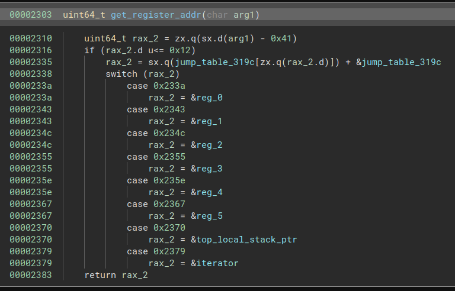

Alright, so the program retrieves the address of the register specified just after the bytecode `0x3A`. After, it retrieves another register's address.

Finally, it moves the value of the second register into the first one.

I think you start understanding the logic behind this program !

*Syntax in a `vmr` file* :

`3a REG REG` -> where `REG` are register numbers

It moves the second register value into the first one.

#### 0x5e

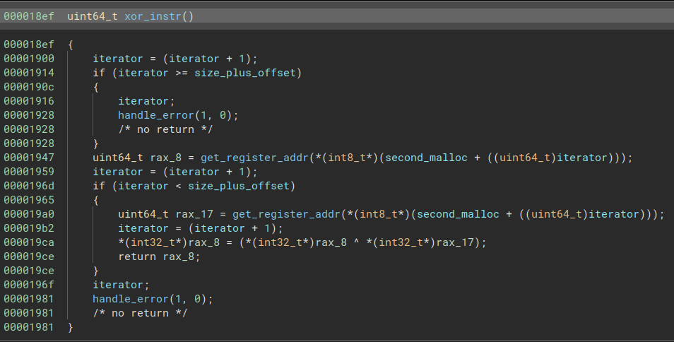

This function is built exactly as the `0x3A` instruction !

It reads the 2 registers specified after the bytecode and retrieves their address. Then, it XORs their values and stores the result into the first specified register.

*Syntax in a `vmr` file* :

`5E REG1 REG2` -> Xor `REG1` and `REG2` together and stores the result in `REG1`

#### 0x2D

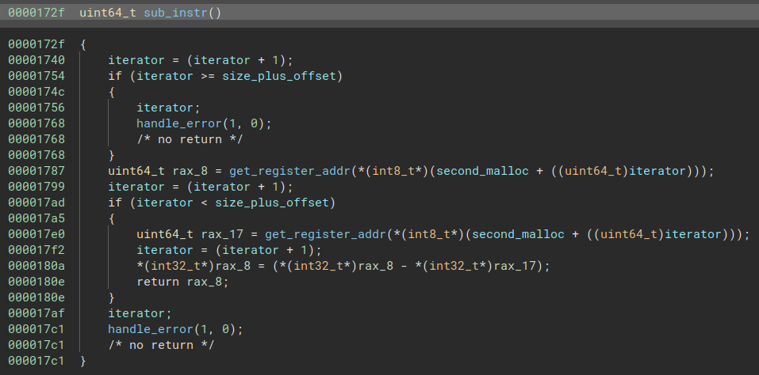

Let's continue into basic mathematical operations instruction !

This one substracts the second register value to the first one and stores the result into the first one !

*Syntax in a `vmr` file* :

`2D REG1 REG2` -> Sub `REG2` to `REG1` and stores the result in `REG1`

#### 0x2B

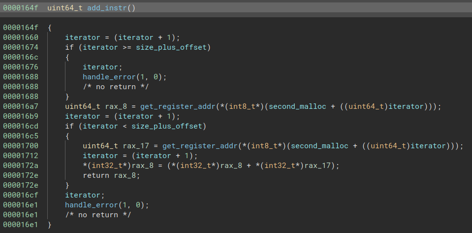

Now, the addition ! This function simply add 2 values stored in specified registers and stores the result into the first one.

*Syntax in a `vmr` file* :

`2B REG1 REG2` -> Add `REG1` to `REG2` values and stores the result in `REG1`

#### 0x26

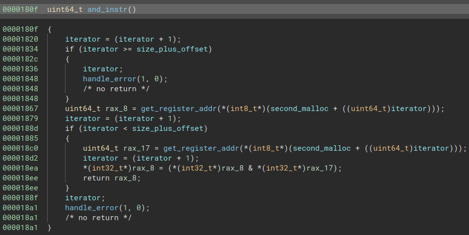

You start to know this structure !

This performs an AND operation on the values stored in the 2 specified registers. And as usual, the result is stored in the first register.

*Syntax in a `vmr` file* :

`26 REG1 REG2` -> Perform an AND between `REG1` and `REG2` values and stores the result in `REG1`

#### 0x24

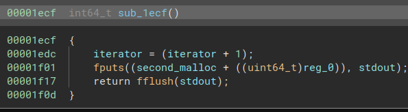

This instruction prints to `stdout` with the function `fputs`. It prints a string until a null byte is reached. The buffer printed is a string (surely stored in the local stack) stored in a buffer at the address `second malloc + reg_0`.

Alright, so `REG0` has to be set correctly before calling this function.

*Syntax in a `vmr` file* :

`24` -> prints a string stored on the local stack at the offset stored in `REG0` to `stdout`

#### 0x25

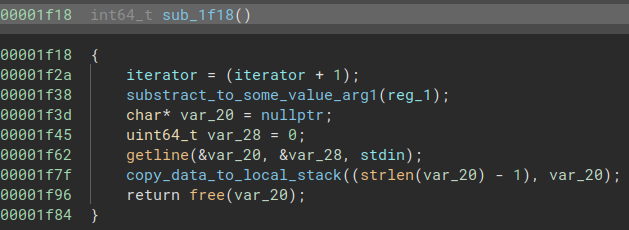

This function shifts the `top_local_stack_ptr` of the value stored in `REG1` (to make some place on the stack) and then calls `getline` function.

Thus, the function retrieves an user input and stores it on the stack.

>You may notice there is no control of the real size of input buffer ! It is not helpful here but it will be for the PWN challenge ;)

*If it stores only `strlen(buffer) - 1`, it is to remove the newline character (`\n`) of the string, but it leaves the null byte*

*Syntax in a `vmr` file* :

`25` -> user can input a line and data is stored on the local stack

#### 0x3e

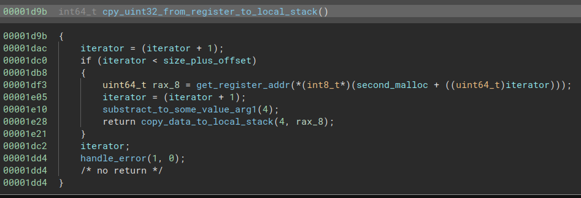

This function retrieves the address of the specified register and will store its value (integer on 4 bytes) on the stack.

You can clearly see the program making space for 4 bytes and then copying the integer onto the stack.

*Syntax in a `vmr` file* :

`3e REG` -> copy int32 stored in `REG` onto the stack

#### 0x3c

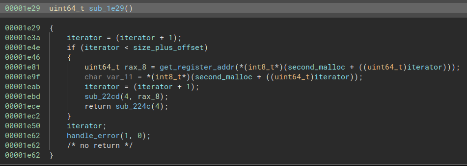

First of all, we can see the program retrieves the address of the specified register. But what it does with it ?

Let's take a look at the 2 unknown functions called !

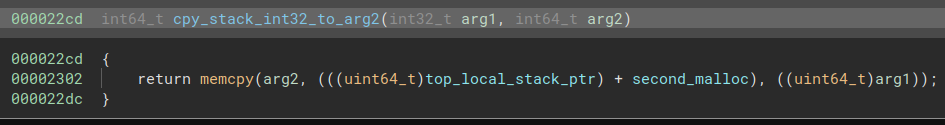

According to the arguments specified in the function calling this `memcpy`, we can conclude it copy the `int32` value on the stack to the register specified above.

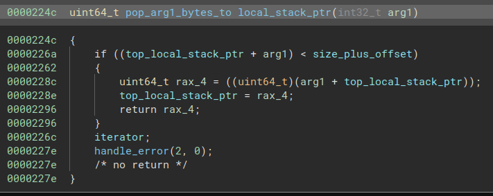

And this one will shift back the `top_local_stack_ptr` of 4 bytes, meaning it "pops" in a way the `int32` read by the previous function ! I put pops between `""` because the value is still on the stack. However, it will be overwritten with the next bytes put on the stack !

Taking into account all the elements above, we can conclude that our function read the `int32` on the top of the local stack, copy it in the specified register and pop it from the local stack.

*Syntax in a `vmr` file* :

`3C REG` -> pop int32 on the top of the stack and store it in `REG`.

#### 0x23

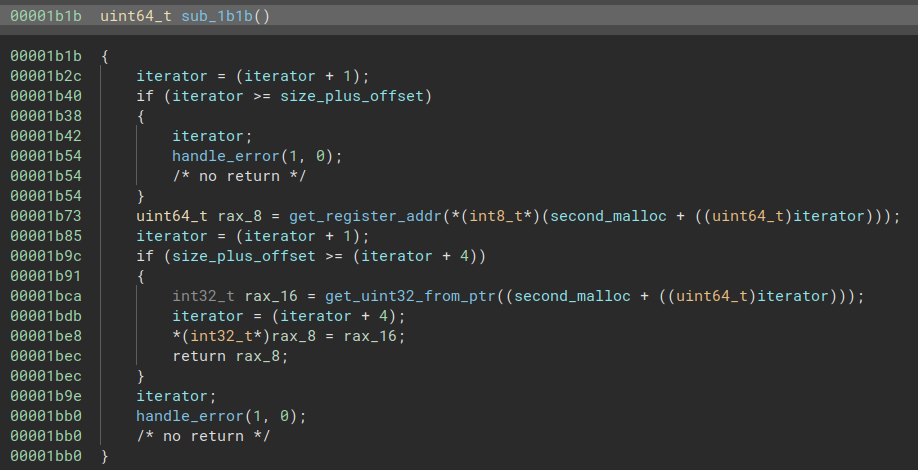

The structure is not that hard, all the more with the function names we put earlier !

It gets the address of the specified register, reads the specified `int32` and store it in the retrieved register.

*Syntax in a `vmr` file* :

`23 REG INT32` -> Store `INT32` into `REG`

#### 0x21

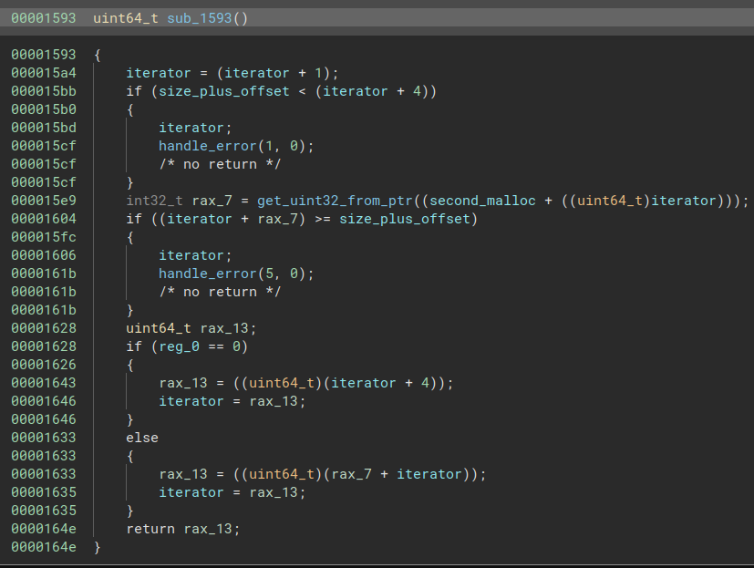

In this instruction, the program retrieves an `int32` directly specified after the bytecode. Then, happened a check whether the program can add the read value to the `iterator` variable without leaving the code area. If so, it returns an error.

Considering there is no error, it will read the value stored into `REG0` and verifoes if it is 0. If not, it will jump to `iterator + INT32`. Else, it will resume the execution of the `.vmr` file at the bytecode just after the read `int32`.

If you consider that the `int32` can be negative, you can clearly see it is a loop condition. If the condition is not met (i.e. `REG != 0`), then you go back into the code, else you continue to the next operation. I don't talk about this innocently, you will see it later in the `.vmr` file.

*Syntax in a `vmr` file* :

`21 INT32` -> Jmp on condition, if `REG0 == 0` do not jump and continue at the next bytecode, else jump at `iterator + INT32`.

#### 0x2f

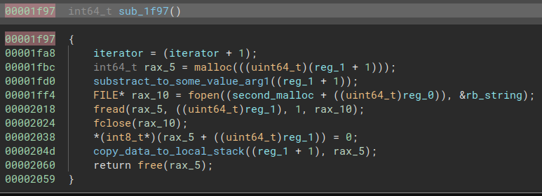

Basically, this function will read `REG1` bytes in the file which name is stored on the local stack at `second_malloc + reg0` address. Then, the content read is stored on the local stack.

*Syntax in a `vmr` file* :

`2F` -> Read `REG1` bytes in a file. The name of the file is on the stack at the offset stored in `REG0`. Copy the content to the local stack.

#### 0x29

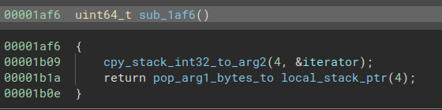

Pretty straightforward, the function pop the `int32` on the top of the local stack to store it in `iterator` variable.

It is very similar to the `return` operation in ASM. Indeed, when a function is called, the current value of the `RIP` register is stored on the stack, so the program knows how to return to the principal execution onc the function reaches its end.

*Syntax in a `vmr` file* :

`29` -> called at the end of a local function

*Example of stack trace:*

```
main
| func1 is called
\_______________func1
				  |  func1 operations...
				  |
return to main <- 0x29 end of func1
|
| main execution
```

#### 0x28

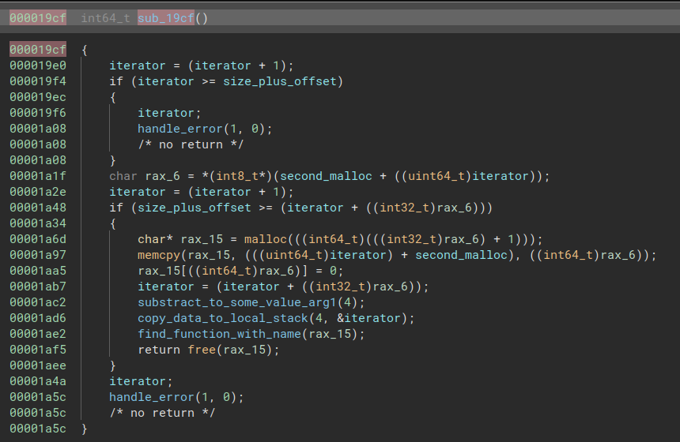

First thing we can notice is that the function reads the byte after the bytecode `0x28`. After, it copies the bytes coming after it in `rax_15`.

Okay so, the byte that came after the bytecode was the length of the string that comes just after it.

Alright, then what does the program do ? It makes some space on the local stack in order to store the value of `iterator`. Then, as it did with the string `main`, it will look the header format for a function with the name it has just retrieved !

In other words, it will call the function specified after the bytecode `28`.

*Syntax in a `vmr` file* :

`28 LENGTH_BYTE FCTN_NAME` -> call the function with `FCTN_NAME` which is `LENGTH_BYTE` length if found. The function takes care to save the current `iterator` value to come back to the main execution once the function is done. Else an error is thrown.


Finally, we reversed all the bytecode instructions ! `vm` doesn't hold secrets anymore ! 

Now it's time to reverse the `.vmr` file !

## `Reverse_my_wm.vmr` ? Will do !

You believed you had finished the reverse part ? Well ... not yet !


Below you will find an instruction by line, making what does the program clearer. To do this, I just read linearly the hexadecimal of the `.vmr` file using the syntax of each bytecode operations. For instance, I know the `3A` bytecode takes 2 bytes after to specify the registers for the MOV operation. But I think you get the gist.

A quick reminder: registers address are found thanks to the value we give to the bytecode, where 0x41 has been substracted to it. Here are the values with their registers:
- 41 -> `REG0`
- 42 -> `REG1`
- 43 -> `REG2`
- 44 -> `REG3`
- 45 -> `REG4`
- 46 -> `REG5`
- 53 -> `top_local_stack_ptr`

```bash
01 04 6d 61 69 6e 02  # main header
7c 17 00 00 00 50 6c 65 61 73 65 20 65 6e 74 65 72  20 74 68 65 20 6b 65 79 3a 20 00 # Load a string of 0x17 in the local stack: "Please enter the key: "
3a 41 53 # Move top_of_local_stack value into REG0
24 # Print the string at the offset value stored in REG0
23 42 00 01 00 00 # Move 0x00000100 into REG1
25 # Wait for user input and stores it on the stack
3a 44 53 # Move top_of_local_stack value into REG3
7c b0 00 00 00 63 3d  21 11 22 52 19 33 09 51 3b 7b 3b 2b 72 6c 62 7a  2d 0e 6b 11 17 02 16 51 30 59 33 59 17 4c 12 55 31 0a 24 5e 16 09 58 14 42 43 06 62 56 4f 20 34 43 79 47 14 4e 2a 1e 36 42 79 47 3b 72 10 7a 34 42 79 03 35 25 44 46 46 5a 42 03 66 7a 36 7c 67 7e 23 44 5a 59 34 7e 6c 00 6f 7d 74 21 4f 23 32 42 79 47 12 30 6d 62 34 42 5a 04 35 72 6c 62 08 06 27 03 77 4c 28 49 67 01 54 06 73 53 9e 9d cb bd 43 14 74 0e 74 62 34 42 3a 28 5f 15 1e 03 40 31 58 67 68 1d 19 10 14 24 15 26 56 52 05 11 0e 62 43 06 62 56 32 23 75 6c 59 14 66 33 2b # Load this data into the local stack (size of 0xb0)
5e 45 45 # XOR REG4 with itself -> set REG4 at 0
23 41 2c 00 00 00 # Load 0x2c into REG0
3a 42 53 # Move top_of_local_stack value into REG1                             <--------------------\
3a 53 44 # Set top_of_local_stack value to REG3 value                                                |
2b 53 45 # Add REG4 and top_of_local_stack adn store the result in top_of_local_stack                |
3c 43 # Pop the 4 bytes on top of the stack into REG2                                                |
3a 53 42 # Set top_of_local_stack value to value in REG1                                             |
3c 42 # Pop the 4 bytes on top of the stack to REG1                                                  |
5e 42 43 # XOR REG1 and REG2 and store the result in REG1                                            |
3e 42 # Copy REG1 value to the address second_malloc + top_of_local_stack                            |
23 46 04 00 00 00 # Set REG5 to 0x04                                                                 |
2b 53 46 # Add REG5 = 4 to top_of_local_stack                                                        |
2b 45 46 # Add REG5 = 4 to REG4                                                                      |
26 45 46 # Perform an AND on REG4 and REG5 and store the result in REG4                              |
23 46 01 00 00 00 # Set REG5 to 0x01                                                                 |
2d 41 46 # Sub REG5 = 1 to REG0                                                                      |
21 d2 ff ff ff # Loop condition: if REG != 0, jmp to iterator + 0xffffffd2 (46 bytes en arrière)  ---/
23 46 00 01 00 00 # Load 0x0100 to REG5
2d 53 46 # Sub REG5 = 0x0100 to top_of_local_stack
28 09 63 68 65 63 6b 5f 6b 65 79 # Call the function "check_key" if found
```

If you rememmber corretly, I launched the binary at the beginning and the error was that the program couldn't retrieve the `check_key` function. Indeed, at first glance, it is not in the program.

However if you look carefully, it loops over the big data chunk (of size `0xb0`) that makes absolutely no sense and XOR it with our user input. 

Indeed, it loops and take 4 bytes after 4 bytes of this blob of data and XOR it with the user input (the key we need to find). 

And we can extract some infos about the key we need to find :

```
5e 45 45 # XOR REG4 with itself -> set REG4 at 0
[...]
2b 45 46 # Add REG5 = 4 to REG4
26 45 46 # Perform an AND on REG4 and REG5 and store the result in REG4
```

With `REG4` initialized to 0, from the lines above, we can conclude that `REG4` is equal to 0 or 4 ! This is due because it is added 4 and performed an AND on it with the value 4.

Also, this register is used to get the user input bytes 4 by 4, which means the key is 8 chars long. Look at those lines:

```
25 # Wait for user input and stores it on the stack
3a 44 53 # Move top_of_local_stack value into REG3 (so the offset to access user_input)
[...]
3a 53 44 # Set top_of_local_stack value to REG3 value
2b 53 45 # Add REG4 and top_of_local_stack adn store the result in top_of_local_stack
3c 43 # Pop the 4 bytes on top of the stack into REG2 
```

Thus, it accesses `user_input[:4]` when `REG4 = 0` and `user_input[4:8]` when `REG4 = 4`.

Now we know the key is only 8 chars long, we can then perform a known plaintext attack to retrieve the key ! 

Huh .. ?

Don't give me that look ! You know function has a specific header right with this custom architecture right  ? We just have to guess the key with it !

Here is the code:

```python
from pwn import xor
from binascii import unhexlify
xored_bytes = """63 3d  21 11 22 52 19 33 09 51 3b 7b 3b 2b 72 6c 62 7a  2d 0e 6b 11 17 02 16 51 30 59 33 59 17 4c 12 55 31 0a 24 5e 16 09 58 14 42 43 06 62 56 4f 20 34 43 79 47 14 4e 2a 1e 36 42 79 47 3b 72 10 7a 34 42 79 03 35 25 44 46 46 5a 42 03 66 7a 36 7c 67 7e 23 44 5a 59 34 7e 6c 00 6f 7d 74 21 4f 23 32 42 79 47 12 30 6d 62 34 42 5a 04 35 72 6c 62 08 06 27 03 77 4c 28 49 67 01 54 06 73 53 9e 9d cb bd 43 14 74 0e 74 62 34 42 3a 28 5f 15 1e 03 40 31 58 67 68 1d 19 10 14 24 15 26 56 52 05 11 0e 62 43 06 62 56 32 23 75 6c 59 14 66 33 2b""".replace(" ","")
key = xor(unhexlify(xored_bytes[:12]), b"\x01\x09check_key\x02")
print(key) # key = b4ByG1rlb4By
```

That confirms the key is 8 char long as it repeats itself !

Here is our key: `b4ByG1rl` !!

Alright, let's enter the key is the program !!

```bash
$ ./vm reverse_my_vm.vmr
Please enter the key: b4ByG1rl
Now, enter the passcode: crap
Congrats! Your flag is: 'v6XG% 
```

Alright, this is the right key as the error is gone !

But where is our flag ?

## Last step !

The only thing remaining is to reverse the `check_key` function, that you can find if you xor the entire blob of data with the key `b4ByG1rl` ! Indeed, we don't what it does to check the passcode.

Once this is xored back, here is the `hexdump` output of this function.

```bash
00000000  01 09 63 68 65 63 6b 5f  6b 65 79 02 7c 1a 00 00  |..check_key.|...|
00000010  00 4e 6f 77 2c 20 65 6e  74 65 72 20 74 68 65 20  |.Now, enter the |
00000020  70 61 73 73 63 6f 64 65  3a 20 00 3a 41 53 24 23  |passcode: .:AS$#|
00000030  42 00 01 00 00 25 3c 46  7c 02 00 00 00 0a 00 7c  |B....%<F|......||
00000040  18 00 00 00 44 04 57 28  24 72 18 3b 44 57 08 5a  |....D.W($r.;DW.Z|
00000050  1e 53 3c 5a 03 6b 2b 58  1c 58 42 16 3a 45 53 23  |.S<Z.k+X.XB.:ES#|
00000060  41 06 00 00 00 23 42 01  00 00 00 23 43 04 00 00  |A....#B....#C...|
00000070  00 3c 44 5e 44 46 3e 44  2b 53 43 2d 41 42 21 f2  |.<D^DF>D+SC-AB!.|
00000080  ff ff ff 3a 53 45 7c 18  00 00 00 43 6f 6e 67 72  |...:SE|....Congr|
00000090  61 74 73 21 20 59 6f 75  72 20 66 6c 61 67 20 69  |ats! Your flag i|
000000a0  73 3a 20 3a 41 53 24 5e  41 41 2e 20 53 57 41 47  |s: :AS$^AA. SWAG|
```

Or if I format it in a prettier way:

```bash
01 09 63 68 65 63 6b 5f 6b 65 79 02 # Check_key header
7c 1a 00 00 00 4e 6f 77 2c 20 65 6e 74 65 72 20 74 68 65 20 70 61 73 73 63 6f 64 65 3a 20 00 # Store string "Now, enter the passcode: " into the local stack
3a 41 53 # Move top_of_local_stack value into REG0
24 # Print the string at the offset value stored in REG0
23 42 00 01 00 00 # Load 0x0100 into REG1
25 # Wait for user input and stores it on the stack
3c 46 # Pop 4 bytes on top of the stack and store them in REG5
7c 02 00 00 00 0a 00 # Store "\n" string on top of the stack
7c 18 00 00 00 44 04 57 28 24 72 18 3b 44 57 08 5a 1e 53 3c 5a 03 6b 2b 58 1c 58 42 16 # Store data on top of the stack
3a 45 53 # Move top_of_local_stack value to REG4
23 41 06 00 00 00 # Load 0x06 to REG0
23 42 01 00 00 00 # Load 0x01 to REG1
23 43 04 00 00 00 # Load 0x04 to REG2
3c 44 # Pop 4 bytes on top of stack and store them in REG3  <-----------------\
5e 44 46 # Xor REG3 and REG5 and store the result in REG3                     |
3e 44 # Copy 4 bytes in REG3 on top of stack                                  |
2b 53 43 # Add REG2 = 4 to top_of_local_stack                                 |
2d 41 42 # Sub REG1 = 1 to REG0                                               |
21 f2 ff ff ff # Loop condition: if REG0 != 0 go to iterator + 0xfffffff2 ----/
3a 53 45 # Set top_of_local_stack value to REG4 value
7c 18 00 00 00 43 6f 6e 67 72 61 74 73 21 20 59 6f 75 72 20 66 6c 61 67 20 69 73 3a 20 # Store string "Congrats! Your flag is: " on top of stack
3a 41 53 # Move top_of_local_stack value into REG0
24 # Print the string at the offset value stored in REG0
5e 41 41 # Set REG0 to 0 by xoring it with itself
2e # End of program
20 53 57 41 47 # Random chars
```

It is very likely the flag is in this function, else I wouldn't even know where to look out.

Before entering the loop, there is a blob of data stored into the stack, and which is used in the loop during the XOR operation.

```
7c 18 00 00 00 44 04 57 28 24 72 18 3b 44 57 08 5a 1e 53 3c 5a 03 6b 2b 58 1c 58 42 16 # Store data on top of the stack
```

And if we loop carefully the XOR operation in the loop, it is xored with `REG5`. And we know `REG5` value is the 4 first bytes of the user input. I can guess that with those lines:

```bash
25 # Wait for user input and stores it on the stack
3c 46 # Pop 4 bytes on top of the stack and store them in REG5
```

as `REG5` is not modified afterwards.

Looks like the passcode is only 4 bytes long ! Once again, we can perform a known plaintext attack because the flag starts with `404CTF{`.

Let's try this with this python code !

```python
from binascii import unhexlify
from pwn import xor
flag_xored = "44 04 57 28 24 72 18 3b 44 57 08 5a 1e 53 3c 5a 03 6b 2b 58 1c 58 42 16".replace(" ","")
key = xor(unhexlify(flag_xored[:7]), b"404CTF{")
print(key) # p4ckp4c -> key = p4ck

print(xor(unhexlify(flag_xored), key[:4]) # 404CTF{P4ck1ng_1s_H3ll!}
```

You can confirm the flag is correct by running:

```bash
$ ./vm reverse_my_vm.vmr 
Please enter the key: b4ByG1rl    
Now, enter the passcode: p4ck
Congrats! Your flag is: 404CTF{P4ck1ng_1s_H3ll!}
```

I loved this challenge ! Understanding how it was simulating a complete architecture was dope !

Thanks to the creator for this one, I took a lot of fun ! :)
