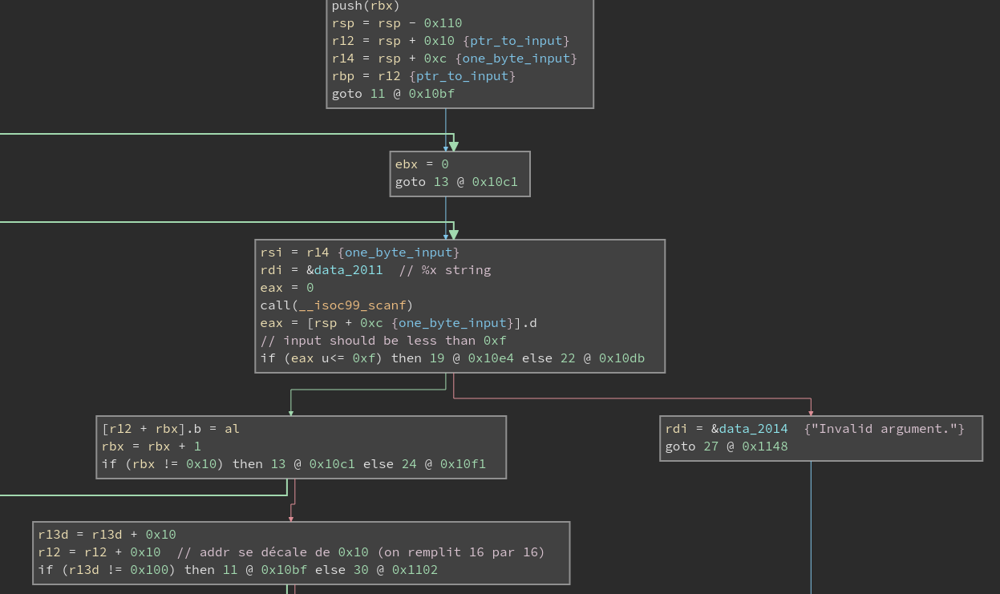
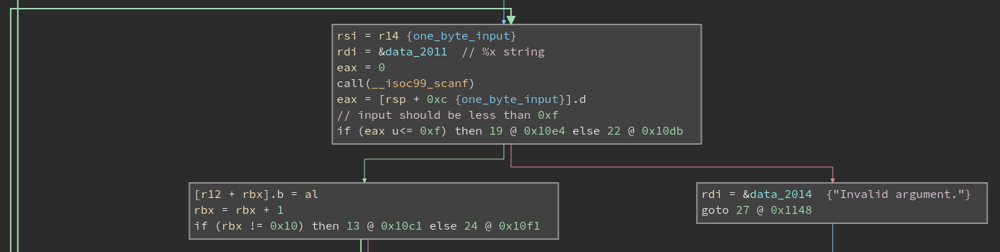
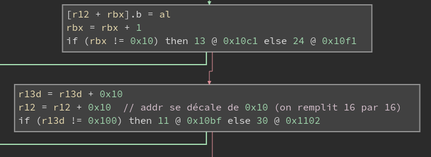
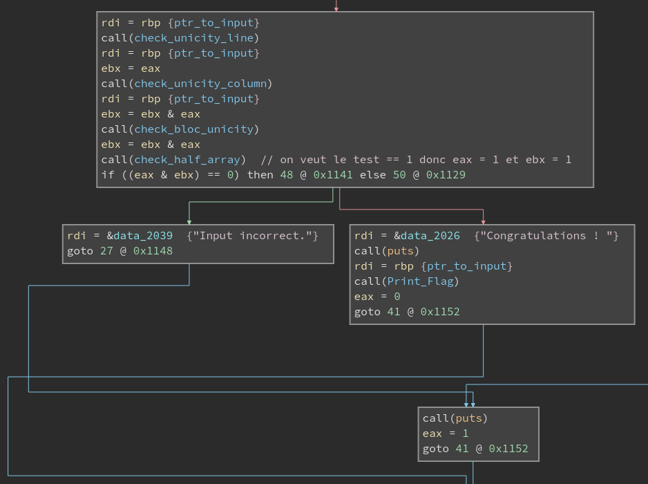
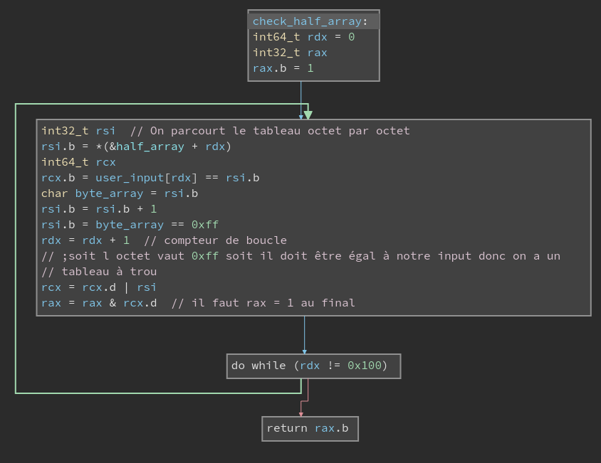
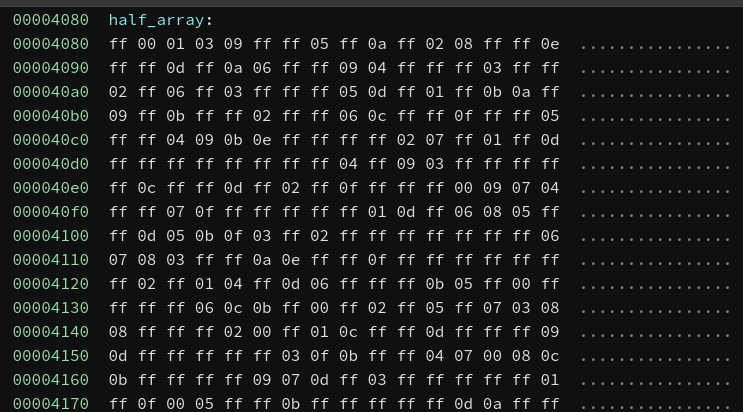
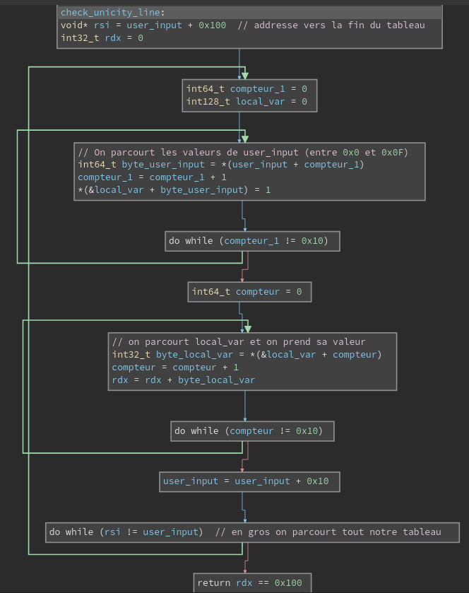
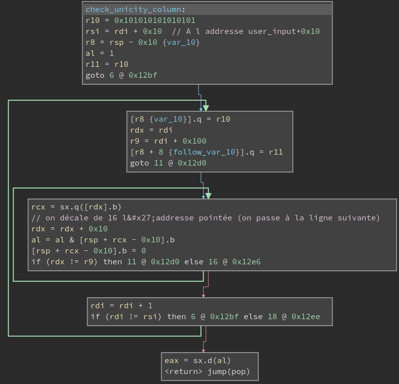
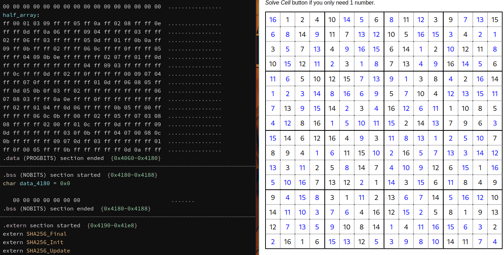

# Description

**Category** : Reverse

**Description** :
Vous devez trouver un moyen d'afficher le flag.
SHA256(`chiffre-unique`) = `8da5abc1b4350d795e41d273560b06e470fb61165af12d08c69df467428a409a`.

# Opening binary ninja

I mainly work with the Low level view of Binary Ninja (replacing some simple asm instructions by C code like `if` conditions, or variable assignement). 

## Analyzing the program

### Input loop




Here is a global view of the loops handling our input ! There are 2 of them.

Let's dig into the first one !



We notice a call to `scanf` ! The first argument is `%x` string, it converts our input to an hexadecimal number and store it at the given address in the second argument: what I called `one_byte_input` on the screen.

Then, it compares our value to `0xf`: if it is greater than 0x1f (strictly), then we will exit the program on this printed string: `Invalid Argument`.

Okay, our input must be between `0x0` and `0x1f`. Now what ? Our input is then moved to the address I named `ptr_to_input` (which is also stored in `r12`) shifted by the counter of the loop. As its name says, it points to where our input will be stored in memory.

We then have the following in memory:
```
Data     Address
0xc   <- ptr_to_input = r12
0x1   <- ptr_to_input + 1
...
0xf   <- ptr_to_input + 0xe
0xa   <- ptr_to_input + 0xf
```

Once the counter is equal to 0x10, we branch on the second loop, let's see what it does:



We increment `r13d` (the four first bytes of the register `r13`) and `r12` by `0x10`. `r13d` is nothing else than our `second_counter`. Adding 0x10 to `r12` is more interesting though: remember that `r12` stores our `ptr_to_input` address, which basically mean we shift where our input will be stored by the same number of inputs already entered !

To simplify the process, you can imagine a matrix that we fill line by line ! We repeat the operation `0x100/0x10 = 16` times.

At the end of all the inputs, we have a matrix of size `0x10 = 16` by `0x10 = 16`.

### Conditions to win



*NB: the functions were not named, this is how I decided to call them once I figured out what they did*

We can notice they all take as an argument the address to our input.

In order to call the function `print_flag`, we must verify the check `eax & ebx != 0` where `eax` is the output of `check_half_array` and `ebx` is the **AND** operation of the output of the 3 other functions. As the functions return a either 1 or 0 (a boolean), we must have `eax == ebx == 1`.

Let's analyze the four different functions: 


*At this moment, I used the decompiler of Binary Ninja*

**Fourth function**

I start by this one because it gives us a lot of information:



We iterate through our entire input and through a `half_array` variable where the following image shows its content. 



We remember that we must return 1. To do that, we should have `rcx == 1` for each iteration. To have this condition, either our `input[rdx=counter]` is equal to the value stored in `half_array` at the position `rdx`, either the byte in `half_array[rdx]` is equal to `0xff`.

We understand this function gives us a part of what our input should be. Let's hope the other functions give us what is hidden behind those `0xff` !


**First function**



In the first loop, we write the value "1" at the address of `local_var` shifted by `input[counter]` where the `counter` variable goes from 0x0 to 0xf. In other words, we go through a line of our input, and each value shifts the address of `local_var` and we put a 1 in there. Moreover, `input[counter]` also goes from 0x0 to 0xf, which means we can write a 1 between the addresses `&local_var` and `&local_var + 0xf`.

In the second loop, we go through the `local_var` values (counter goes from 0 to 0xf too) and we add the value (either 0 either 1) to `rdx`.

Finally, we shift the address of our input by 0x10, meaning we go through the next line on the next iteration and we repeat the process until the entire matrix is iterated over.

We want a boolean 1 in output of the function. To achieve this, we need that `rdx == 0x100`, which is the length of our matrix. It basically means, we should add a 1 to `rdx` at each iteration, which is possible if all values on the line are different. Indeed, it would mean `local_var` has a 1 at each address between `&local_var` and `&local_var + 0xf`.

To sum up, this function verifies each value appears one time in each line.


**Second function**



*What's happening here ?*

To begin with, a first loop put at the address `var_10` and at `var_10 + 0x8` the value `0x0101010101010101`. Thus, the value `0x01 * 16` is stored at the address `var_10` because we work on a 64bit architecture.

The inner loop will take the first byte of our input (in `rdx` was the address stored in `rdi` which is the first argument of the function: known as our input), then shifts the address in `rdx` by 0x10, meaning the program looks for the first value on the next line on the next iteration and so on. 
The operation `[rsp + rcx - 0x10].b` means we retrieve the byte stored at the address `r8 + rcx` where `r8 = rsp - 0x10` and `rcx = the byte of our input` (comprised between 0x0 and 0xf).
It will perform on the value retrieved an AND operation with a 0x01 value as the data stored between `r8` and `r8 + 0xf`, which are the possible outputs of `[rsp + rcx - 0x10].b`, are filled with 0x01 bytes. The result of the operation is stored in the first byte of `eax`. Then, it puts a 0 instead of the 0x01 value at the address hit and continue the loop. The loop is iterated 16 times as `rdx` is incremented of 0x10 and we loop over until `rdx = r9 = rdi + 0x100` and at the beginning of the loop, `rdx` was initialized at `rdi`.

At the end, we return `eax` and we want the function to return 1. It means, we should always hit a `0x01` value during the inner loop. 

The outer loop then increment `rdi` until `rdi = rsi`, where `rsi = rdi(beginning) + 0x10`.

Thus, the function checks if the values on columns are all different too ! Indeed, if 2 values were equal, we would have the operation `al = al & 0` as a 0 would have already been put at the address pointed by `r8 + rcx`.


**Third function**

At this point, I was pretty sure it was a Sudoku implementation and that we needed to solve the grid seen in the fourth function.

Which means, I partially look what the function does (all the more that it looks particularly disgusting). I just check the loops were doing what I wanted, so **I checked the indexes of the loop** reproducing the operations with python. I saw the counters were going through blocks of size 4x4 from left to right and from up to down.

It confirms what I already knew, we need to solve a Sudoku grid of size 16x16 !

# Solve

We understand we must **complete a Sudoku grid of dimensions 16x16** ! Being very lazy, I used an online solver with the partial grid found in the $4^{th}$ function:



>On the left, the partial grid
>
>On the right, the online solve of the grid

The Win function simply hashes our input with SHA256 algorithm. I had some troubles with hashes on another challenge *(I see you `Weird Shell`...*), thus I didn't want to hash directly what I found. This is why, I wrote a little script to input the complete grid to the program using `pwntools`. Here is the script:

```python
grid = [
[16, 1, 2, 4, 10, 14, 5, 6, 8, 11, 12, 3, 9, 7, 13, 15],
[6, 8, 14, 9, 11, 7, 13, 12, 10, 5, 16, 15, 3, 4, 2, 1],
[3, 5, 7, 13, 4, 9, 16, 15, 6, 14, 1, 2, 10, 12, 11, 8],
[10, 15, 12, 11, 2, 3, 1, 8, 7, 13, 4, 9, 16, 14, 5, 6],

[11, 6, 5, 10, 12, 15, 7, 13 ,9, 1, 3, 8, 4, 2, 16, 14],
[1, 2, 3, 14, 8, 16, 6, 9, 5, 7, 10, 4, 12, 13, 15, 11],
[7, 13, 9, 15, 14, 2, 3, 4, 16, 12, 6, 11, 1, 10, 8, 5],
[4, 12, 8, 16, 1, 5, 10, 11, 15, 2, 14, 13, 7, 9, 6, 3],

[15, 14, 6, 12, 16, 4, 9, 3, 11, 8, 13, 1, 2, 5, 10, 7],
[8, 9, 4, 1, 6, 11, 15, 10, 2, 16, 5, 7, 13, 3, 14, 12],
[13, 3, 11, 2, 5, 8, 14, 7, 4, 10, 9, 12, 6, 15, 1, 16],
[5, 10, 16, 7, 13, 12, 2, 1, 14, 3, 15, 6, 11, 8, 4, 9],

[9, 4, 15 ,8, 3, 1, 11, 2, 13, 6, 7, 14, 5, 16, 12, 10],
[14, 11, 10, 3, 7, 6, 4, 16, 12, 15, 2, 5, 8, 1, 9, 13],
[12, 7, 13, 5, 9, 10, 8, 14, 1, 4, 11, 16, 15, 6, 3, 2],
[2, 16, 1, 6, 15, 13, 12, 5, 3, 9, 8, 10, 14, 11, 7, 4]]


from pwn import *

p = process("./chiffre-unique")

for i in range(16):
    for j in range(16):
        value = hex(grid[i][j] - 1)[2:]
        # print(value)
        p.sendline(value)

flag = p.recvuntil(b"}")
print(flag)

# b'Congratulations ! \nFCSC{00119cf9663f8f5448fe632c0776484f8ca5a5d323a02b469b4cf66af54c53e6}'
```

Running the script, we get the following output with the flag :

```
[ FCSC2023/reverse/chiffre_unique ] & python solve.py
[+] Starting local process './chiffre-unique': pid 22338
/home/math/Documents/ctf/FCSC2023/reverse/chiffre_unique/solve.py:31: BytesWarning: Text is not bytes; assuming ASCII, no guarantees. See https://docs.pwntools.com/#bytes
  p.sendline(value)
[*] Process './chiffre-unique' stopped with exit code 0 (pid 22338)
b'Congratulations ! \nFCSC{00119cf9663f8f5448fe632c0776484f8ca5a5d323a02b469b4cf66af54c53e6}'
```