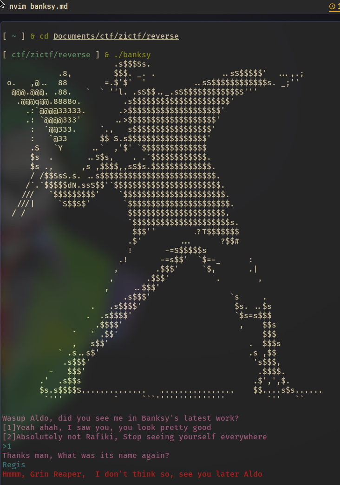
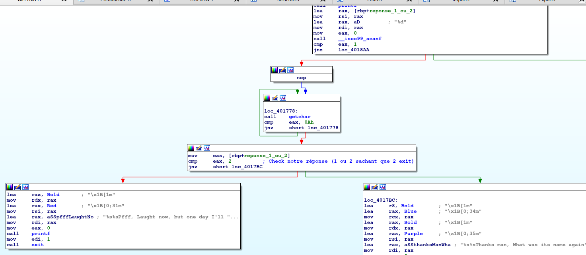
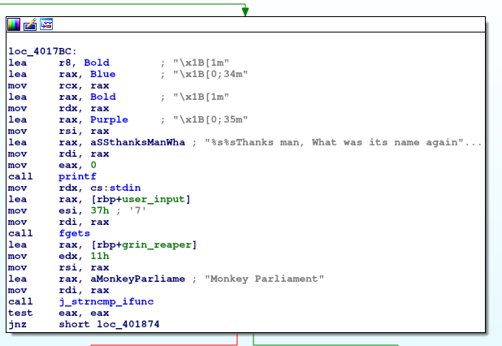
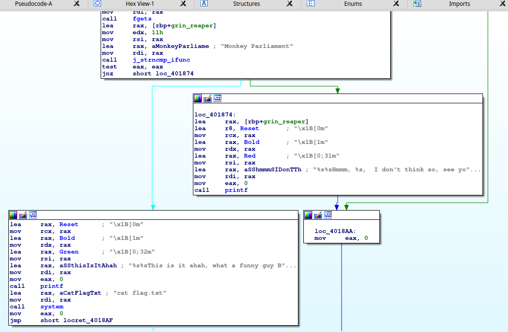
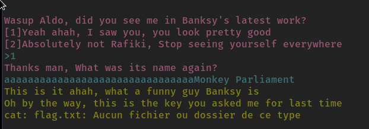

# Banksy

Difficulty: 600 pts

### Wording: 
>You went to see the last Banksy exhibition, help Rafiki to remember in which work he appears

### File: [banksy](./banksy) 


# Playing around

First of all, I always launch the binary in order to discover what it does (playing with
it by giving args or not).

For *Banksy*, we are expected to choose between 1 and 2. Entering 2 will basically exit the program
whereas the choice 1 is more interesting as the program continue. 



We are then asked a name. Entering anything to test its behavior, the program exits.

# Entering in the assembly with IDA

I won't lose much time explaining why the program ends when we do not enter a digit for the choice (1 or 2) but you can see it on the screenshot below (at the top). Scanf would return 1 if it can assign a value to its argument (and you can see he wants a digit with the `%d`).




We can confirm that entering the choice 2, the program will exit (branch on the left). Indeed, our choice enters `eax` register and is then compared with 2:  `cmp eax,2`.

If `eax = 2`, the cmp instruction will set the Zero Flag. As a result, we won't take the jump and will end up on the left branch.

## Alright, what happens when we enter 1 ?



We notice the call to the function `strncmp`. Let's look at its args !

As a reminder, the signature of the function is:
```c
int strncmp( const char * first, const char * second, size_t length );
```

Second reminder, the args of a function are stored in the registers :
- `rdi` for the first arg
- `rsi` for the second arg
- `rdx` for the third arg (or `edx` if we use only 32 bits of the register)

Well, we clearly see the first arg is the string "Monkey Parliament" (of length `0x11` by the way), the second argument is stored on the stack at what I called `rbp+grin_reaper` (exact address is `rbp - 0x20`) and the third arg is `0x11`. Very logical according to the signature.

However, we don't have a hold on the string `rbp+grin_reaper`, which is annoying. 

## Where our input went ?

You can notice the call to `fgets` function right above. As usual, a reminder to the signature can help us understanding the args passed to the function:

```c
char * fgets( char * restrict string, int maxLength, FILE * restrict stream );
```
Reading from file stream, the string of maxLength is stored at the address in the first arg.

Respectively:
- 1st arg: `rbp + user_input` (`=rbp - 0x40`)
- 2nd arg: 0x37
- 3rd arg: stdin


## I am looking for a flag please, have you seen it ?



Very easy, the `strncmp` must succeed and the remote server would run `cat flag.txt` with a call to system.

# Solve

**Alright, how am I supposed to make the `strncmp` succeed if I don't control the strings compared ?**

Well, let's do little maths !

`fgets` allows us to write 0x37 char on the stack at the address `rbp - 0x40`. Then, we can control the string form `rbp - 0x40` to `rbp - 0x03`. 

And the string compared is at the address `rbp - 0x20` and should be 0x11 long. (From `rbp - 0x20` to `rbp - 0x09`).

I guess my input can overwrite what is stored at `rbp - 0x20` ! 

I have to write 0x20 char and then have the exact string which is compared in `strncmp`, known as "Monkey Parliament". (and 0x20 + 0x11 < 0x37).

Then, an input looking like "aaaaaaaaaaaaaaaaaaaaaaaaaaaaaaaaMonkey Parliament" should do it.

We can send it when we are asked the name and we get (an error because I did it locally :)):



>Flag: ZiTF{t0py22ix8kw1sbsbbqg1iqe8hs91a44r}