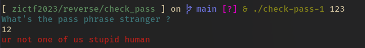
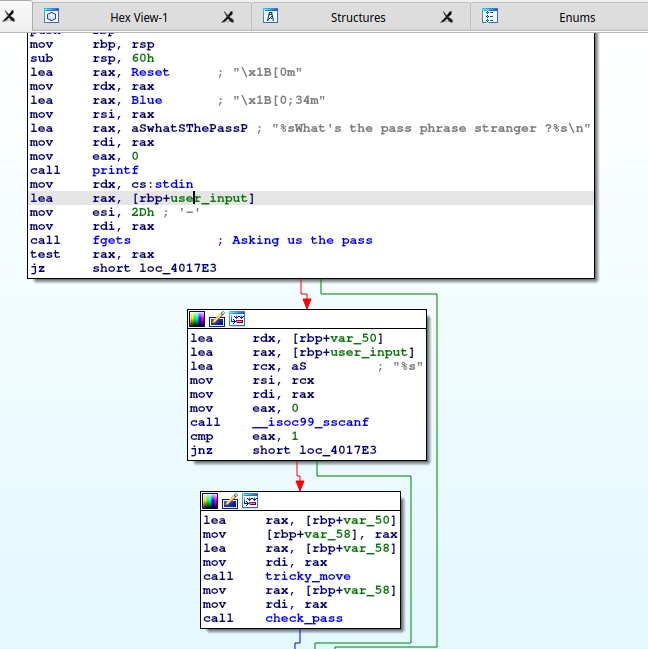
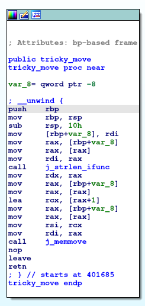
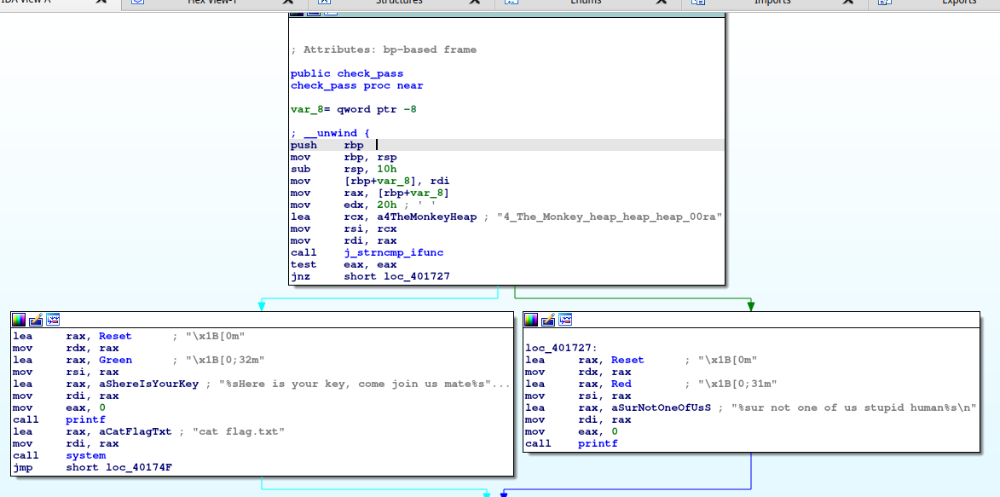

# Check-pass-1

Difficulty: 200 pts

### Wording: 

Well I forgot to jot down the wording but the idea is to retrieve the pass :)


### File: [check-pass1](./check-pass-1) 


# Playing around



Looks like it doesn't care of args given to the binary.

The program asks us a pass, you should enter one, and exits whether it is correct or incorrect (I guess so !). 

Let's confirm that by diving into the assembly !

# Entering in the assembly with IDA

Below is the `main` function seen by IDA. 



I notice a call to `fgets`. Let's see the signature of the function to understand the args given to it.

```c
char * fgets( char * restrict string, int maxLength, FILE * restrict stream );
```
As a reminder, the args of a function are stored in the registers :
- `rdi` for the first arg
- `rsi` for the second arg
- `rdx` for the third arg

Then, we understand that, respectively:
- 1st arg: the address in which the string will be stored (`rbp + user_input` = `rbp - 0x30`).
- 2nd arg: 0x2D
- 3rd arg: stdin

Thus, the function reads 0x2D char from stdin and stores it at the address `rbp - 0x30`.

Very rapidly, the second block asserts the `sscanf` call goes well (the goal of those instructions is to move the string we input at the address `rbp + var_50` = `rbp - 0x50`). If yes, we continue to the following block, else we exit.

More interesting, we notice 2 function calls: one to `tricky_move` and another to `check_pass`. Let's dive into these functions.

Alright, first of all, `tricky_move` is called with one argument: our input string. You can see thee multiple `mov` to put our input (stored in `rbp - 0x50`) in `rbp - 0x58`. This same address is moved in `rdi` later.

`Tricky_move` will return something (a string being the most likely) and will be passed as a parameter for the function `check_pass`.



The subtlety lies in the `memmove` call. 

As usual, the signature: 

```c
void * memmove( void * destination, const void * source, size_t size );
```

The destination address is in `rdi`, which is the address `rbp + var_8`.

The source address is in `rsi` = our input moved to the left 1 time (*exemple: input="test" -> rsi="est"*). This is because of the line `lea rcx, [rax+1]` where `rax` contains our input at that time.

The size is the result of the `strlen` call.

So our input sees its first char stripped and is returned by the function `tricky_move`.




The check is done by a `strncmp` call. 

```c
int strncmp( const char * first, const char * second, size_t length );
```

Looking at its args, it compares the string returned by `tricky_move` (passed as a parameter of this function) and the hardcoded string:
"4_The_Monkey_heap_heap_heap_00ra".

It compares the first 0x20 char of those strings, which is the length of the hardcoded string.

If the `strncmp` succeed, the pass will be printed by a system call: `cat flag.txt`.

# Solve

It strips the first character of your input and compare it with a harcoded string.

Netcat the remote server and input the pass: `X4_The_Monkey_heap_heap_heap_00ra` where X is any char.

You will get the flag !

>FLAG: ZiTF{3oihas7re2fw97orqcxmvq1qmu2l4lw4}